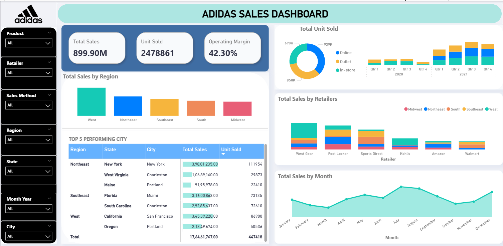
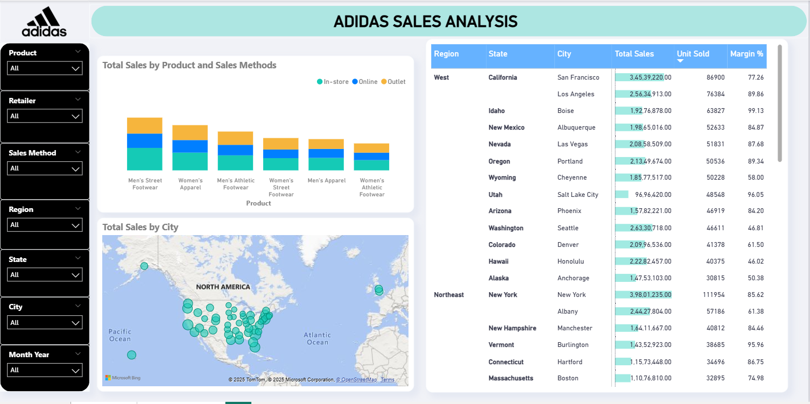

# 📊 Adidas Sales Dashboard

Welcome to the **Adidas Sales Dashboard Project**, a Power BI-based business intelligence solution designed to analyze and visualize Adidas sales performance across regions, products, and time periods.

---

## 🔍 Overview

This project leverages Power BI to deliver interactive insights into Adidas's sales data. It helps stakeholders track KPIs such as **Revenue**, **Units Sold**, **Profit Margin**, and **Customer Segments**, enabling data-driven decision-making.

---

## 🧩 Features

- 🚀 **Sales Overview**: Track total sales, profit, and units sold over time.
- 🌍 **Geographical Analysis**: Visualize regional performance using maps.
- 👟 **Product Category Performance**: Understand top-performing products and categories.
- 🕒 **Time Series Trends**: Filter and explore sales by year, quarter, and month.
- 🧑‍🤝‍🧑 **Customer Segments**: Break down performance by customer demographics.
- 📈 **Dynamic Filtering**: Use slicers for custom analysis (Region, Gender, Product, etc.)

---

## 📂 Project Files

| File Name                    | Description                                  |
|-----------------------------|----------------------------------------------|
| `Adidas Sales Dashboard.pbix` | Power BI project file containing data model, transformations, and visualizations. |

---

## 🔧 How to Use

1. **Install Power BI Desktop** (if not already):  
   👉 [Download Power BI Desktop](https://powerbi.microsoft.com/desktop/)

2. **Open the Dashboard**:  
   Launch Power BI Desktop and open the file `Adidas Sales Dashboard.pbix`.

3. **Interact with the Report**:  
   Use slicers, filters, and visuals to explore different aspects of the sales data.

---

## 📊 Sample KPIs Tracked

---

## 🎯 Objectives

- Provide actionable insights into Adidas’s sales performance.
- Identify trends, outliers, and areas for improvement.
- Support sales and marketing strategy decisions through data visualization.

---

## 🔐 Data Privacy

*Note: This project uses sample sales data for demonstration purposes and does not contain real customer or financial information.*

---

## 🙋‍♂️ Contact

For queries or suggestions, please reach out via GitHub issues or email at [artibankar16@gmail.com].
